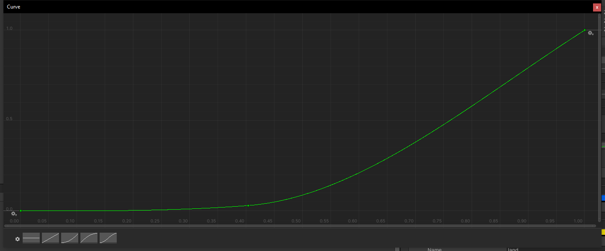

[](https://classroom.github.com/online_ide?assignment_repo_id=446224&assignment_repo_type=GroupAssignmentRepo)


**The University of Melbourne**
# COMP30019 – Graphics and Interaction
# Group 14 Project-2 README


## Tasks Checklist
- [x] Read the handout for Project-2 carefully.

- [x] Brief explanation of the game.

- [x] How to use it (especially the user interface aspects).

- [x] How you designed objects and entities.

- [x] How you handled the graphics pipeline and camera motion.

- [x] The procedural generation technique and/or algorithm used, including a high level description of the implementation details.

- [x] Descriptions of how the custom shaders work (and which two should be marked).

- [x] A description of the particle system you wish to be marked and how to locate it in your Unity project.

- [x] Description of the querying and observational methods used, including a description of the participants (how many, demographics), description of the methodology (which techniques did you use, what did you have participants do, how did you record the data), and feedback gathered.

- [x] Document the changes made to your game based on the information collected during the evaluation.

- [x] References and external resources that you used.

- [x] A description of the contributions made by each member of the group.


## Table of contents
* [Team Members](#team-members)
* [Technologies](#technologies)
* [Explanation of the game](#explanation-of-the-game)
* [How to use it](#how-to-use-it)
* [Objects and entities](#objects-and-entities)
* [Graphics pipeline and camera motion](#graphics-pipeline-and-camera-motion)
* [Procedural generation](#procedural-generation)
* [Custom shaders](#custom-shaders)
* [Particle system](#particle-system)
* [Querying and observational methods](#querying-and-observational-methods)
* [Improvements](#improvements)
* [References](#references)
* [Contributions](#contributions)


## Team Members
| Name | Task | State |
|:---:|:---:|:---:|
| Yunqi Ma     |Terrain/Shaders     |Amazing   |
| Mingyang Liu |Gameplay/AI/UI      |Fabulous  |
| Jiahao Chen  |Particle/Procedural |Awesome   |
| Ju Wang      |Evaluation/Shader   |Fantastic |


## Technologies
Project is created with:
* Unity 2021.1.13f1
* Ipsum version: 2.33
* Ament library version: 999


## Explanation of the game
#### Background
* Our game is a first person shooter (FPS) inspired by Back 4 Blood. :gun:
* It is set on an isolated island, which is surrounded by sea. :desert_island:
* There are some creatures on the island that only appear at night and together attack outsiders. :skull:


#### Objective
The aim is to survive as long as possible. Players can use gun, gernades and gasoline barrels to attack. Gasoline barrel will not explode unless it is hit by bullets or explosion. Points and money are awarded for killing enemies. Players can upgrade their abilities and buy supplies in the store. As the survival time increases, there will be more enemies and they will become more powerful. Good luck warriors!


## How to use it
#### Home Scene 
Clicking _**Play**_ will start the game scene. This may take a few seconds because the game scene need to be preloaded. Clicking _**Option**_ will lead to game settings, but this is not available in editor.

#### Control
A tutorial is set at the start of game, which includes all the control buttons. Players can pause the game at any time to check the buttons. 

#### Gaming
_**Score and Time**_ are diplayed in the upper right corner. _**Weapons**_ (Gun, Ammo, Gernade, Barrel) are displayed in the right bottom. Health is in the left bottom. In the _**Store**_, players can click on the cards that they want to buy. _(Note: There is a method to get infinite money in the store.)_

#### Note: It may take approximately 7 minutes to open in editor for the first time (depend on devices). An installer has been made for our game, which is in the root folder. It will provide you much faster access to the game.
* [Installer](/USE4LOOP_Setup_(x86-64).exe): /USE4LOOP_Setup_(x86-64).exe


## Objects and entities
None of our team members had training or talent in design, so we decided to go with a simple style. Most of our objects and entities were free stuff online. When we were choosing those models, we tried to make sure they were low poly with simple colours. For example, the grenade and placeable barrel are distinguishable and straightforward objects. 

<p align="center">
  
</p>

We put some effort into picking the enemy entities. We want the player to tell the threat level of different enemies. Our project is an FPS game, so we learnt some experience from some older FPS titles like Halo 1. In the first Halo game, players can distinguish different enemies by their looks. Enemies have different and noticeable colours and shapes. Players will intuitively think that the red enemy might be stronger than the blue enemy. Those enemies that are taller and bigger might have higher defence and attack than those who are smaller. This is a very common practice in older FPS titles, but enemies are less distinguishable with the advanced modern graphics. For example, in the new halo game, the colour differences are way less distinguishable. We follow this practice from old FPS titles. The two enemies types in our game look a lot different. The weaker one looks way smaller than, the stronger one. Also, the weaker one has a similar colour to the terrain. We decide to let them blend into the terrain to increase the difficulty while telling the players that they don’t have a significant threat because they don’t have a bright or noticeable colour. On the other hand, the stronger enemy is way bigger than the player (taller than the player’s camera position) to give the player an oppressed feeling. Also, to show that this enemy has a high threat, we give it a glowing red eye that looks cool and tells the player that this type of enemy is dangerous.

<p align="center">
  
</p>


## Graphics pipeline and camera motion
#### Graphics
To reduce rendering load, we decided to use objects made up of simple polygons as mentioned above. Besides, we only rendered arms, hands and guns for the character since this is a single player FPS. No one else needs to see the character's body. Moreover, we enabled culling for our terrain since it requires huge computational force. There will be more detailed descriptions on our water and terrain later.

#### Camera
A first-person percpective is implemented because we want to provide players with good immersion. The character is not empathised, instead, we want players to focus on enemies. Vertical camera rotation is clamped between -90 to 90 degrees so that players won't feel dizzy. Limited perception of surroundings also adds to the horror. Be aware of enemiews behind you!


## Procedural generation
[Terrain](/Assets/Terrain/)： /Assets/Terrain/
<p>
We used procedural generation to generate terrain. All the different terrain types, the height of the terrain and different regions were all procedurally generated based on Perlin Noise. We need a noise that is random but still generating gradually. We looked into Perlin Noise and decide this will be the best fit because it looks like mountainous terrain. (Also unity provides a built-in Perlin noise function).
</p>

<p>
First, we generate a noise map based on the Perlin noise calculation. Noise map is the base for other properties of the terrain like height, regions and texture. There are two main variables that could result in different noise maps which are frequency and amplitude which decide the shape of the noise. To manipulate the noise map to make it looks more like a real terrain by layering multiple levels of noise. Different layers are set as variable octaves. Changing this will result in a more detailed noise map due to adding more layers of noise into the noise map. Also, we need to control the frequency and amplitude of different layers of noise to get the best result. So we set up adjustable variable lacunarity and persistence to change the frequency and amplitude of octaves.
</p>

<p align="center">
  
</p>

<p>
In order to make our terrain more realistic. Different types of regions are needed. We decide to assign different regions based on the map height of the noise map. Both the regions (mountain, water grass, sand...) and texture are based on the height of the noise map. It is the core that makes our terrain looks good. There will be more explanation of how we implement a texture onto our mesh in the shader part of our report.
</p>

<p>
In order to get a proper terrain that players can interact with, a noise map is not enough. We need a 3d object and we decided to use mesh based on Brackeys’ YouTube tutorial. We need to code the vertex array and fill the vertices with shapes to create our mesh.
 We add triangles into the mesh while carefully adding the vertices to avoid culling issues and fulling the whole map with mesh.
</p>

<p align="center">
  
</p>

```c#
//https://www.youtube.com/watch?v=64NblGkAabk&t=619s
    public void AddTriagnle(int a, int b, int c)
    {
        triangles[triangleNum] = a;
        triangles[triangleNum + 1] = b;
        triangles[triangleNum + 2] = c;
        triangleNum += 3;
    }
```

<p>
After generating the mesh, we need to create different terrain shapes based on the noise map’s height. Uvs was created to tell the location of the vertices to others on the mesh relatively. After setting all these up, we used the level of detail to be the factor of how detailed the mesh should be. We originally were aiming for a big terrain so some far way meshes’ level of detail may be reduced but we scratch that idea. To test our games in a faster time, the level of detail was preserved. Then the height of different shapes is mainly based on two factors: mesh height multiplier and mesh height curve. The multiplier will be used on the height of the noise map to generate different heights and curve on the mesh. However, it will look weird because sometimes the low height regions like water and sand will also be curved which is not realistic. A mesh height curve is implemented to make sure that the mesh is following the shape of the height curve to be more realistic. A simple mesh collider was implemented. Finally, the player can interact with our terrain.
</p>

<p align="center">
  
</p>

<p>
The terrain still looks strange with some cut off mountains and no border. Then we decide to implement a border to our terrain. We implement this by creating a new map that has the value 0 at the centre to 1 around the edges and subtracting the height map from it. Then we can get a new map where the edge will be a height of 0. This height of 0 won’t have any new shape generated. This can be seen as a border of the terrain. We covered the terrain with water. You can read more in the shader section about the water that is covering the border. We also added invisible walls to block the player from falling off the border.
The border is a map with the same size as the heightmap with value(height) fading. To achieve this, we implement a simple falloff map calculation. We found a formula on YouTube and implement the fading method to get a proper falloff map.
</p>

```c#
static float FadingCurve(float value)
    {
        float a = 3.2f;
        float b = 2.3f;
         //https://www.youtube.com/watch?v=COmtTyLCd6I&list=PLFt_AvWsXl0eBW2EiBtl_sxmDtSgZBxB3&index=11
        return Mathf.Pow(value, a) / (Mathf.Pow(value, a) +Mathf.Pow(b - b * value, a));
    }

```

<p>
After implementing the border, we finally get a proper island with no strange mountain cut off.
</p>

<p>
We initially want the map to be randomized every time we start a new game. However, after a series of evaluations, we gave up on the randomization. The map is way too messy and sometimes way too empty. Some variables were set when we try to randomize the terrain. Variables like x and y offset and seed. Those two offsets were basically shifting the noise map based on the x and y offset we set. Seed is just a random number corresponding to different noise maps. We use seeds to finally get a noise map that fits our game. After testing to find a good terrain, we turned off the updates through editor because we don't want any accident that lead to a wrong terrain. However, after a few code changes we can still enable it or just change it in the code.
</p>

<p>
We also implement a procedurally generated tree. We feel that only generating terrain is a little bit boring. In brief, procedurally generating trees shared a lot of similarities with generating terrain. The idea of procedurally generating the tree is based on the looks of trees. We need a shape of root then “growing” up to branches. The branches will be thinner than the root and they are expanding to different angles. By limiting the number of branches, the height of the tree we get the trees we want and litter them onto the terrain.
</p>

<p align="center">
  
</p>


## Custom shaders
[Shader1](/Assets/Terrain/Shaders/Water.shader): /Assets/Terrain/Shaders/Water.shader

<p align="center">
  
</p>

<p>
The first shader we wrote is the water shader. We want a good-looking water shader to simulate waves to make our game more visually appealing. This shader has three main properties, which are colour, strength and speed.

 
In this case, we just used the colour blue as the colour which is the colour of most oceans. Strength decides how strong or the slope of the wave will be, and speed is just the speed of waves. These two properties mainly work on the world position of the applied objects. To be more specific, it works on the y world position of the applied objects because that is what makes the wave which is just a vertical shape transformation. The displacement in the shader is the way we want the waves’ shape to look by deciding how high and low the waves can be. We choose cos as our limit to get a simple wavey shape.
  
  
Culling was turned off because there is no reason to perform culling on a water plane.
</p>

[Shader2](/Assets/Terrain/Shaders/Terrian.shader): /Assets/Terrain/Shaders/Terrian.shader


<p align="center">
  
</p>

<p>
The second shader we wrote is a surface shader that blends textures to have a nice transition of different textures based on their height. In this way, the texture will look more realistic rather than some clear separated parts. 
The core is lerpping the heights to get a blend. To determine whether the texture should be drawn by comparing the base start height and the heightPercent. This is calculated within the variable drawStrength, only the heightPercent is higher than the base start height, the drawStrength won’t be zero which means that the final texture will be drawn and the strength will be multiplied on the texture to show the strength or clarity of the drawn texture. The drawStrength is also determined by the blend strength which we set to be adjustable. We can adjust different blend strengths based on different height regions. After evaluating with querying methods, we finally came up with this base blend strength which looks the most realistic.
</p>

<p>
When projecting the texture, we encountered some issues. When we try to map texture properly, different projections to xz, xy or zy axes will result in horrible stretches of the texture in different directions while other directions look good. To solve this we used a simplified version of triplanar mapping.
</p>

```c#
//https://blog.csdn.net/liu_if_else/article/details/73833656
float3 triplanar(float3 worldPos, float scale, float3 blendAxes, int textureIndex) 
{
    float3 scaledWorldPos = worldPos / scale;
    float3 xProjection = UNITY_SAMPLE_TEX2DARRAY(baseTextures, float3(scaledWorldPos.y, scaledWorldPos.z, textureIndex)) * blendAxes.x;
    float3 yProjection = UNITY_SAMPLE_TEX2DARRAY(baseTextures, float3(scaledWorldPos.x, scaledWorldPos.z, textureIndex)) * blendAxes.y;
    float3 zProjection = UNITY_SAMPLE_TEX2DARRAY(baseTextures, float3(scaledWorldPos.x, scaledWorldPos.y, textureIndex)) * blendAxes.z;
    return xProjection + yProjection + zProjection;
}
```

<p>
So, we need to weigh different combinations of axes, blend those different projections based on the normal, and then add them together to make sure that the texture won’t be stretched weirdly among different terrain types. 
At last, we output the texture based on the draw strength and texture to make the terrain looks realistic with blending and texture that fits the right world position(height).
</p>

<p>
We believe we need culling this time. Calculating and rendering the blending texture can be really heavy and can be costly. We don't need to display the texture of that part of the terrain when the player couldn't see it.
</p>


## Particle system
[Explosion](/Assets/Prefab/Explosive/Explosion/ExplodeBig.prefab): /Assets/Prefab/Explosive/Explosion/ExplodeBig.prefab

This system aims to simulate explosion of gasoline barrel.
* Flames are divided into inner and outer ones. The inner flame is blue since it has higher temperature.
* Smoke will first erupt and then spread.
* Ash can diffuse or erupt. Also there will be craters on the ground after explosion.
* Explosion can also incur shockwave and light flash.
* Some effects may look a bit strange when you start the game in editor for the first time, but things will be back to normal soon.

Following is the effect:
<p align="center">
  
</p>


## Querying and observational methods
During the development of the game, we have collected opinions from several friends of us. We’ve selected a group of people who has years of gaming experience with many genres of game. So that they can give us some valuable feedback from their experience with the mega titles. Also, some people who don’t have a lot of gaming experience are also included to check our game’s usability.

<p align="center">
  
</p>

We’ve selected a group of ten people, all of our age with 8 boys and 2 girls. 2 boys and 1 girl in this group has little gaming experience on PC but some gaming experience on either gaming consoles or smart phones. Overall, the review is quite positive, they had fun playing our game and most of them can play the game without even checking out the key mapping.

They are invited to try out some early stages of the game. Method we used is divided into two parts, observation and querying. While our friends play, we ask them to play with sharing screen turned on with discord, so we can observe how the player plays the game and approaches of different players for the same goal. After a few plays, we asked them to fill out a questionnaire about how they feel about the game and all other things associated with it. We value their opinions a lot and several changes are made to the game during the development according to player’s thoughts.
* Link to our questionnaire: https://forms.gle/ygkv6ESFmn6iM8Nu9


## Improvements
#### Changes based on query
In the special effect and sound effect section, some player complained about the sea being unrealistic. Especially with the strength and speed of the wave and the associated sound effect. Based on their feedback, we opened a discord screen sharing and adjust the wave strength and speed until the player feels better. We also added a new sound effect for the sea to make it more realistic.

For the game difficulty, some players, especially those new to FPS, felt that it is easy to die. We finally decided to let the health bar automatically recover if the the player is out of the fight for a few seconds. This tends to increase players' moving distance because they can escape to remote areas if they want to have a break. Utilization of our map is also significantly improved. Players can take advantage of different terrains to choose their battle strategy.

#### Changes based on observations
One of the greatest changes that has been made is the random procedural generation of the map. The map has a lot of altitude variations presenting mountains in game. Players that played a random map with lots of hills often struggles from getting around the map. Leading to a relatively hard to watch experience while playing the game. Players who played a map with only a small number of hills also created over simplified gaming experiences. Players who experienced those maps gave a relatively lower mark for map section of the questionnaire and complains about it while talking with us after the play. That’s why we disabled it from the game and generate map from a same seed as discussed above to avoid such things from happening.

While watching player play, we will often tell them with the cheat button in the buying menu that doubles the money. With this button creates a brand-new style of playing. Very fun to watch and “Very Satisfying to play” according to some of the players. First thing most players do with infinite money is to buy player abilities upgrades, and some player just stick with that for the whole play. But some player who buys tons of explosives enjoys the game a lot. Explosions equals enjoyment. Those players really enjoy the game and gave a higher overall score. They should probably go check out Just Cause series.


## References
#### Terrain, Procedural
* https://www.youtube.com/watch?v=COmtTyLCd6I&list=PLFt_AvWsXl0eBW2EiBtl_sxmDtSgZBxB3&index=11
* https://www.youtube.com/watch?v=64NblGkAabk&t=619s
* https://en.wikipedia.org/wiki/Centripetal_Catmull%E2%80%93Rom_spline
* https://en.wikipedia.org/wiki/Frenet%E2%80%93Serret_formulas
* https://blog.csdn.net/liu_if_else/article/details/73833656

#### Enemy AI, Daylight, Particle...
* https://www.youtube.com/watch?v=xppompv1DBg&t=444s
* https://www.youtube.com/watch?v=m9hj9PdO328
* https://www.youtube.com/watch?v=BYL6JtUdEY0&ab_channel=Brackeys
* https://www.youtube.com/channel/UCYbK_tjZ2OrIZFBvU6CCMiA

## Contributions
|Name|Contributions|
|:---:|:---:|
|Yunqi Ma     | Terrain generation, Custom shaders
|Mingyang Liu | Gameplay logic, Enemy AI, UI Design
|Jiahao Chen  | Particle, Procedural tree, Report format
|Ju Wang      | Evaluation design, Gather feedback
